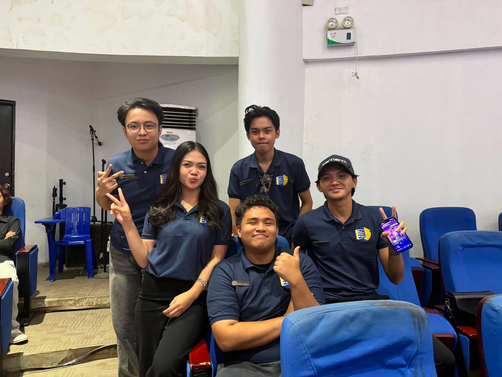

<h1 align="center">✨ Meet Our Awesome Team ✨</h1>

  <i>Welcome to our group portfolio! We are a team of passionate individuals collaborating to build amazing things.</i>

<!-- The team picture you uploaded -->

  

 

<h2 align="center">👥 Group Members</h2>

<table align="center" style="border-collapse: collapse; border: none;">
  <tr>
    <td align="center" width="250">
      <!-- Auto-generated avatar based on initials -->
      
        
      <strong>👩‍💻 Jude Andrei Rabaya</strong>
       
      
       
      <i>"Loves organizing and coding."</i>
    </td>
    <td align="center" width="250">
      
        
      <strong>👨‍💻 Jay Mark Labial</strong>
       
      
       
      <i>"Code is poetry."</i>
    </td>
     <td align="center" width="250">
      
        
      <strong>👨‍💻 Jim Francis Margaja</strong>
       
      
       
      <i>"Database whisperer."</i>
    </td>
  </tr>
  <tr>
    <td align="center" width="250">
      
        
      <strong>👨‍💻 Jake Lloyd Quejada</strong>
       
      
       
      <i>"Pixel-perfect designs."</i>
    </td>
    <td align="center" width="250">
      
        
      <strong>👨‍💻 Reahlyn Ermita</strong>
       
      
       
      <i>"Designing user experiences."</i>
    </td>
    <!-- Empty cell to balance the grid -->
  </tr>
</table>

---

<h3 align="center">🛠️ Tech Stack & Tools</h3>

  <!-- Examples of tech badges you can customize -->
  
  
  
  

<h3 align="center">📫 Reach Out to Us!</h3>

  
  

